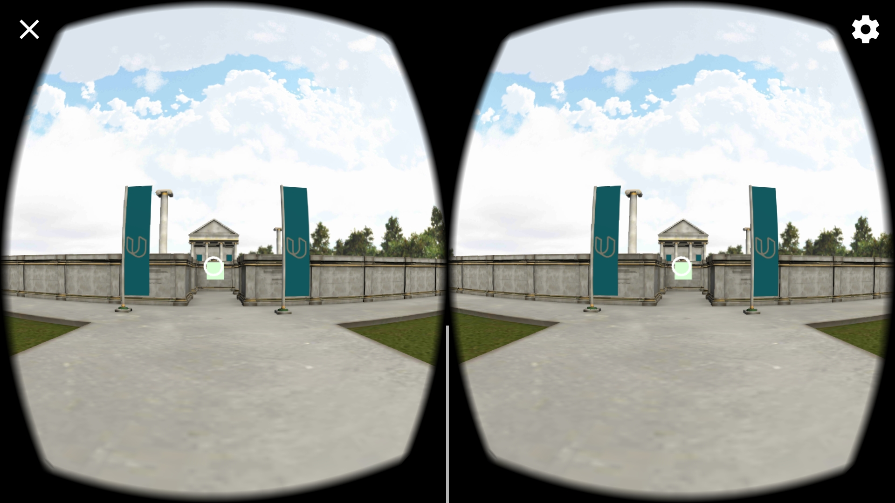
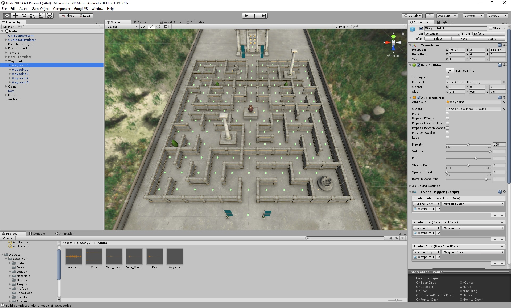

  # El laberinto #

Un juego simple de realidad virtual usando android y unity, el proyecto consiste en completar el laberinto hasta el final usando los cuadrados que
estan en ella.

## Acerca De ##

  Este proyecto se completó como parte de estudiantes de la UPDS, La materia de **Aplicaciones Moviles**,  para el
proyecto final, **El laberinto**. La rúbrica del proyecto incluía la integración del GVR SDK,
crear objetos interactivos de monedas, llaves y puertas, agregando jugabilidad
funcionalidad y optimización del resultado para ejecutarlo en un teléfono.

## Versiones usadas ##

- [Unity LTS Release 2017.4.4][unity_version]
- [GVR SDK for Unity v1.100.1][gvr_version]

## Capturas ##

  
  

<!-- References -->

[UPDS]: https://portal.upds.edu.bo/index
[unity_version]: https://unity3d.com/unity/qa/lts-releases?version=2017.4
[gvr_version]: https://github.com/googlevr/gvr-unity-sdk/releases/tag/v1.100.1
